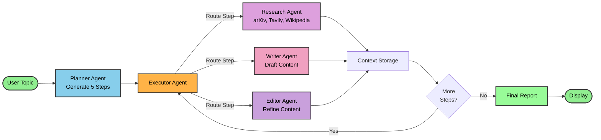
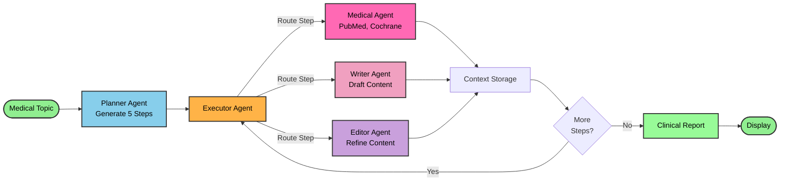

# Agentic Workflow Diagrams

## 1. Research Assistant Workflow

---

## 2. Clinical Evidence Workflow

---

## 3. OpenRCA (Database Query) Workflow

```mermaid
flowchart LR
    Start([User Query]) --> DB[Load Database<br/>& Schema]
    DB --> Gen1[Generate SQL V1]
    Gen1 --> Exec1[Execute V1]

    Exec1 --> Eval{Evaluate<br/>Correctness}
    Eval --> |Needs Improvement|Refine[Refine SQL V2]
    Eval --> |Correct|Interpret

    Refine --> Exec2[Execute V2]
    Exec2 --> Interpret[Interpret Results]

    Interpret --> Success{Success?}
    Success --> |No & < 5 attempts|Eval
    Success --> |Yes|Answer[Natural Language<br/>Answer]

    Answer --> End([Display + SQL Details])

    style Start fill:#90EE90,stroke:#333,stroke-width:2px,color:#000
    style End fill:#90EE90,stroke:#333,stroke-width:2px,color:#000
    style DB fill:#87CEEB,stroke:#333,stroke-width:2px,color:#000
    style Gen1 fill:#FFD700,stroke:#333,stroke-width:2px,color:#000
    style Eval fill:#DDA0DD,stroke:#333,stroke-width:2px,color:#000
    style Refine fill:#FFB347,stroke:#333,stroke-width:2px,color:#000
    style Interpret fill:#98FB98,stroke:#333,stroke-width:2px,color:#000
    style Answer fill:#87CEEB,stroke:#333,stroke-width:2px,color:#000
```

---

## Workflow Comparison Table

| Aspect | Research Assistant | Clinical Evidence | OpenRCA |
|--------|-------------------|-------------------|----------|
| **Primary Agent** | research_agent | medical_agent | database_agent |
| **Number of Agents** | 5 (planner, executor, research, writer, editor) | 5 (planner, executor, medical, writer, editor) | 1 (database with 3 sub-functions) |
| **Data Sources** | arXiv, Tavily, Wikipedia | PubMed, Cochrane | SQLite RCA Database |
| **Orchestration** | Sequential multi-agent | Sequential multi-agent | Iterative refinement loop |
| **Tool Calls** | Max 3 per research step | Max 3 per medical step | Multiple SQL executions |
| **Output Format** | Academic markdown report | Clinical evidence report | Natural language + SQL details |
| **Execution Time** | 2-3 minutes | 2-3 minutes | 20-40 seconds |
| **Context Passing** | Execution history | Execution history | SQL results & feedback |
| **Quality Control** | Editor agent review | Editor agent review | GPT evaluation loop |
| **User Interface** | Step-by-step progress | Step-by-step progress | Chat interface |

---

## Key Design Patterns

### Research/Medical: Multi-Agent Orchestration
Planner → Executor → Specialized Agents → Context Accumulation → Final Report

### OpenRCA: Iterative Refinement
Generate SQL → Execute → Evaluate → Refine → Interpret → Answer (Loop until success or max 5 attempts)

